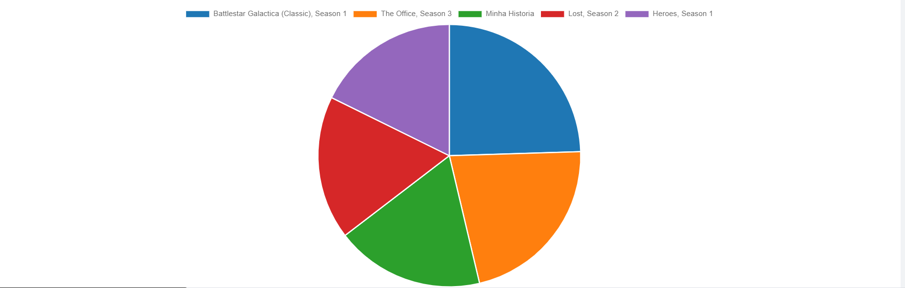
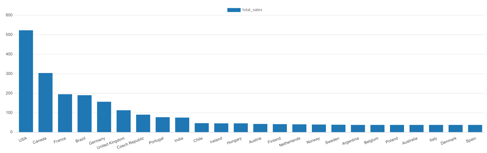
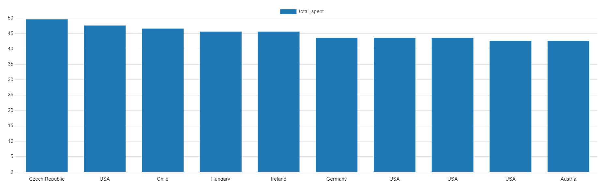
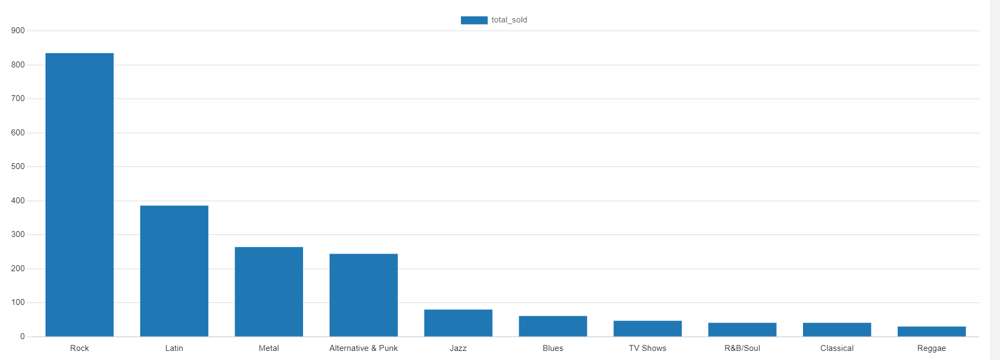
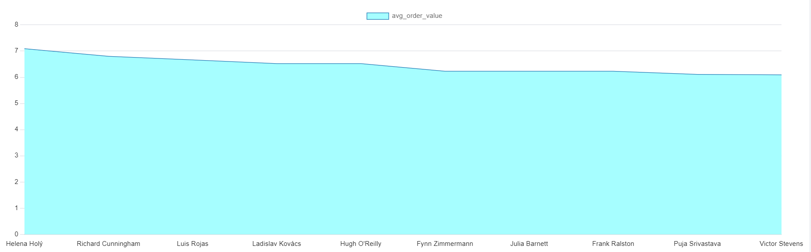

# SQL Sales Analysis - Chinook Database

# Project Description

This project analyses sales data from the ficticious "Chinook Database"

# Technologies

- Database: PostgreSQL
- SQL GUI: pgAdmin 4
- Technologies: PostgreSQL, SQL, Python, Pandas, Matplotlib
- Data source: Chinook Database ([Github link] https://github.com/lerocha/chinook-database)

# Analyses (Queries)

-----------------------------------------------------------------
| Nr. | Analysis                    | file                      |
|-----|-----------------------------|---------------------------|
| 1   | Top-grossing albums         | 01_top_albums.sql         |
| 2   | Sales by country            | 02_sales_by_country.sql   |
| 3   | Highest-spending customers  | 03_top_customers.sql      |
| 4   | Most popular genres         | 04_top_genres.sql         |
| 5   | Sales per months            | 05_sales_by_month.sql     |
| 6   | Average cart value          | 06_avg_cart_value.sql     |
-----------------------------------------------------------------

# results
The folder contains all the results of the executed queries

# visualizations
This folder presents visual results of SQL analyses performed on the
[chinook sample database](https://github.com/lerocha/chinook-database).
The goal is to gain business insights using SQL to visualize key performance metrics.

## 1. Top Revenue-Generating Albums

This query shows the five albums with the highest total revenue generated through track sales.
It joins album, artist, track, and invoice data to compute the totals.

---

## 2. Sales by Country

The United States leads by far in total sales, followed by Canada, Brazil, and France.
This helps identify key markets and regions with potential for growth.

---

## 3. Top Customers by Revenue

This analysis ranks customers based on total money spent.
These high-value customers are prime targets for loyalty programs or premium offerings.

---

## 4. Most Popular Genres by Track Sales

This query determines which music genres have the highest number of tracks sold.
Rock, Latin, and Metal appear to be the most consumed genres by track count.

---

## 5. Sales Per Month (Time Series)

This time series analysis reveals monthly sales trends. We can observe seasonal spikes,
such as high activity in the summer and end-of-year periods.

---

## 6. Average Order Value per Customer

This metric shows the average invoice amount per customer,
offering insight into customer purchasing behavior and value.

---

## Summary

Through these six queries, we uncovered:
- The top-performing albums and genres
- High-revenue customers and countries
- Monthly sales dynamics and customer purchase patterns

This type of SQL-based reporting is essential for data-driven decisions in any online sales business.

---

# Author
 Junior, Gogang Kengne